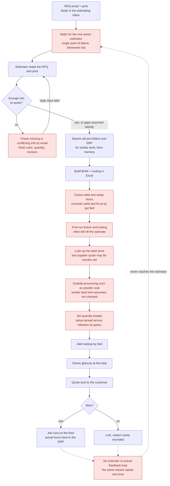

# Current State: How Boone Creek Fabrication Quotes Today

> **Boone Creek Fabrication is fictional.** It stands in for a ~40-person metal fabrication job shop in central Iowa that builds custom weldments, brackets, guards, frames, and tube assemblies for ag and construction equipment OEMs and tier-1 suppliers. All names and data in this repo are synthetic.

Every quote goes through one senior estimator, gets built in Excel from memory and old folders, and is never checked against what the job actually cost.

**Red = bottleneck.** Dashed lines show information that exists but never reaches the next quote.

## Bottlenecks

| Bottleneck | Why it hurts | What Quote Memory does about it |
|---|---|---|
| **Estimator queue / single point of failure** | Every RFQ waits on one person, and response time depends on that person's workload. When they are on vacation or retire, most of the shop's quoting know-how goes with them. | **Triage (S/M/L)** fast-tracks repeat work so it takes one screen. **Analog retrieval** proposes a starting BOM + routing from the closest past job, so a less experienced estimator can build a solid quote. Every override is saved with its reason, so the know-how stays in the shop. |
| **Missing or conflicting info** | Back-and-forth emails add days. Gaps that get assumed silently turn into margin losses or disputes after the PO. | **Intake extraction** pulls every field with the exact source sentence and a confidence level, and never makes up a value. **Deterministic gap and conflict rules** catch things like a missing powder coat color or qty 250 in the email vs. 200 on the spec. The estimator marks each gap *ask* or *assume*: assumed gaps carry a stated assumption and a contingency %, and one drafted clarification email covers all the *ask* items. |
| **Weld and setup hours guessed** | These are the biggest and least predictable labor lines, especially on cosmetic welds and first-time fit-up. A bad guess erases the margin on the whole job. | **Per-line evidence weighting** builds each hour estimate from similar past jobs' *actuals* (weighted highest), past quotes, notes, and shop defaults. Every line shows a value, a range, and a green/yellow/red confidence chip. **Pattern P1** (synthetic history: cosmetic-weld jobs ran ~35–40% over quoted weld hours) appears as a labeled adjustment on the weld line. |
| **Forgotten fixture costs** | First-run weldments need a fixture, but the old job used as a template already had one, so the cost never makes it onto the new quote. | A **difference rule** adds a "fixture (one-time)" line when the job is a first run with no fixture line. **Pattern P2** (synthetic: fit/tack setup ran ~1.9x on such jobs) and earlier estimator overrides such as "new fixture needed" show up as evidence on the setup line. |
| **Stale material price** | Steel moves fast (synthetic history: up ~15% in the last 6 months). A months-old price quietly cuts margin on every quote that uses it. | Material evidence decays with a **30-day half-life**, so an old price drops the line's confidence and widens the cost band. The ledger then flags: *"Re-quote material or shorten quote validity to 15 days."* |
| **Outside-processing lead time** | Powder coat and other vendor steps add calendar days nobody checked. The shop either misses the promised date or pays to expedite. | A **due-date check** compares the requested date with the minimum feasible lead time from the routing plus outside processing, and flags it as a risk. An **expedite option** (illustrative: +12% price for 1 week faster) prices speed explicitly. |
| **Guessed quantity breaks** | Setup cost spread across releases by feel means small releases lose money and large ones overprice. | Routing keeps **setup hours and per-unit run hours separate**, so cost per unit at each release quantity is calculated, not guessed. The quote preview shows **unit price per quantity break**. |
| **No estimate-vs-actual feedback loop** | Actual hours sit in the ERP but are never compared with the estimate, so the same misses repeat. Losses are rarely explained. | **Actuals are the highest-authority evidence (1.0).** **Pattern detection** surfaces systematic overruns from history. Every Gate 1 / Gate 2 **override needs a written reason, which is saved to memory** and shows up as evidence on the next similar RFQ. |
