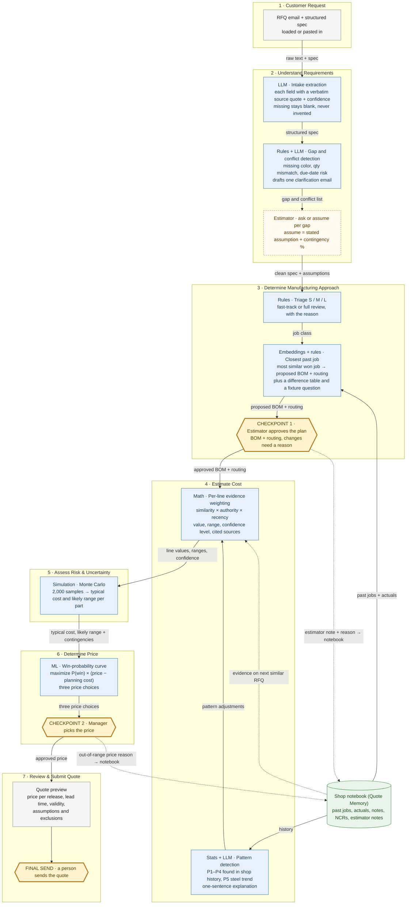

# Future State: Quoting with Quote Memory

**Quote Memory: Evidence-Weighted Quoting.** *Every number in the quote shows its sources, and how much you trust it depends on how good those sources are.*

The case's seven stages stay the same. What changes: AI does the reading, searching, weighting, and simulating, people make the calls at three checkpoints (two approvals and a person sending the quote), and every estimator note teaches the next quote. The shop design runs on a local PC (Streamlit + qwen3:8b via Ollama + local embeddings), works from past-job CSV exports, and needs no ERP swap. Customer data never leaves the building. The competition demo uses a hosted model (Claude Haiku 4.5) shown from a warmed cache; the model never touches cost or price math. All data and the shop (Boone Creek Fabrication) are synthetic and fictional.

**Legend:** blue = AI and analytics (the tag says which kind) · gold hexagon = human checkpoint (or the final send) · dashed gold = human decision · green = shop notebook · **dashed arrows = the learning loop: estimator note + reason → shop notebook → evidence on the next similar RFQ.**

**Guardrail:** the LLM **never produces a cost or price number.** It only extracts fields (with source quotes and confidence), drafts the clarification email, and writes one-sentence pattern explanations. All math is deterministic Python. Every model call is cached, so the tool also runs in offline mode with no model at all.

## How the five screens map to the seven stages

The app walks the user through five screens. The process map above stays on the case's seven stages.

| Screen in the app | Case stage(s) | What happens there |
|---|---|---|
| **1 · Read the request** | 1 Customer Request, 2 Understand Requirements | The email is read into fields, each with its source sentence and a High / Medium / Low confidence. Gaps and conflicts are listed, the estimator chooses ask or assume, and one clarification email is drafted. A delivery check compares the due date with the minimum lead time. |
| **2 · Plan the work** | 3 Determine Manufacturing Approach | Triage badge (Fast track / Standard review / Full review), the closest past job, "how this order is different from that job", the fixture question on a new revision, and **Checkpoint 1: the estimator approves the plan**. |
| **3 · Cost it** | 4 Estimate Cost, 5 Assess Risk & Uncertainty | The cost table (every line with its confidence and "why do we believe this number?"), lessons from past jobs, steel price age and safety cushions, typical cost and "very likely between $A and $B". |
| **4 · Set the price** | 6 Determine Price | Three price choices (lower, recommended, higher) with the chance of winning and the profit for each, and **Checkpoint 2: the manager approves the price**. |
| **5 · Send the quote** | 7 Review & Submit Quote | Ready-to-send checklist, quote preview, download. A person sends it. |

## Stage by stage

| Stage | What AI does | What the human decides | What flows to the next stage |
|---|---|---|---|
| **1. Customer Request** | Takes the RFQ email text and structured spec as they arrive (loaded or pasted). No ERP swap. | Nothing yet. Anyone can load the RFQ. | Raw email text + structured spec. |
| **2. Understand Requirements** | **LLM** extracts each field with the verbatim source sentence and a confidence level. Missing fields stay blank. Python normalizes material aliases (e.g., "3/8 plate" = "0.375 A-36 HR"). **Rules** flag gaps (e.g., powder coat color missing), conflicts (e.g., qty 250 in the email vs. 200 on the spec), and due-date vs. lead-time risk. **LLM** drafts one clarification email covering every *ask* item. | For each gap, **ask** the customer or **assume** (stated assumption + contingency %, e.g., "assume black, +3%"). Whether to send the drafted email. | Clean spec, stated assumptions, contingency % per assumed gap. |
| **3. Determine Manufacturing Approach** | **Triage** labels the job S / M / L (fast-track vs. full review) and gives the reason. **Closest-past-job retrieval** blends description embeddings with structured match (family, material, thickness, qty, weld class) to find the most similar won past job with actuals. Its BOM + routing is rescaled for qty. **Difference rules** add, remove, or keep lines (a one-time fixture on first runs, a fixture question on new revisions, powder coat on a finish change, plate weight scaled for a different thickness), shown in a difference table. | **Checkpoint 1:** the estimator edits and approves the proposed BOM + routing. Any edit needs a written reason, which is saved to the shop notebook. On a new revision the estimator answers "Does the old fixture still fit the new revision?" (yes keeps the fixture at 0 hours; no uses the 6 hr shop default, editable). | Approved BOM + routing (estimator notes go to the shop notebook). |
| **4. Estimate Cost** | **Evidence weighting** per BOM line and routing op: score = similarity × source authority (actual 1.0, note/estimator note/pattern 0.8, past quote 0.6, shop default 0.3) × recency decay (half-life: material 30 days, labor 540, notes 365). Each line gets a value, range, High / Medium / Low confidence (green/yellow/red chip), and clickable sources. **Pattern detection** adds labeled adjustment rows (e.g., P1 cosmetic-weld overrun, P2 first-run fixture setup, P3 thick-plate bending rework); the P5 steel trend becomes an escalation contingency when the material quote is stale. The **LLM** writes one sentence explaining each pattern. Stale material is flagged. | Reviews Medium and Low lines in the evidence panel ("Why do we believe this number?"). Anything to change goes back through Checkpoint 1, with a reason. | Per-line value, low/high range, confidence. |
| **5. Assess Risk & Uncertainty** | **Monte Carlo** (2,000 samples, triangular per line) adds up cost per part as a **typical cost** and a **likely range**, plus gap contingencies (the technical names are P50 for the typical cost and P10 to P90 for the range). Lower confidence means a wider range. The app says "very likely between $A and $B"; the histogram is behind the "Show the details" switch. | Whether to re-quote material, shorten validity, or firm up an assumption instead of carrying the risk. | Typical cost and likely range per part, contingencies. Planning cost = typical cost + half the gap to the high-end cost. |
| **6. Determine Price** | A **win-probability model** trained on past won/lost quotes (price-to-cost ratio, customer segment, new customer, qty bucket, customer history) produces an expected-profit curve. The recommended price maximizes chance of winning × (price − planning cost), so wider uncertainty means a bigger cushion. The app shows **three price choices**: lower, recommended and higher (the low end, peak and high end of the recommended range), each with its chance of winning, profit per part if we win, and average profit. P4 flags a price-sensitive customer. | **Checkpoint 2:** the manager picks the price (one of the three, or another amount). A price outside the recommended range needs a written reason, which is saved to the shop notebook. | Approved price per part, lead time. |
| **7. Review & Submit Quote** | Builds the quote preview: unit price by release size, setup per release and one-time tooling listed separately, lead time, validity window (shortened to 15 days if material is stale), assumptions and exclusions from *assume* gaps. Markdown/HTML download. | **Final send:** a person reads it and sends it. | Quote to the customer. Every estimator note + reason already sits in the shop notebook as evidence for the next similar RFQ. |

## The chain reaction

Change any input and everything downstream re-runs. That includes flipping a gap from *ask* to *assume*, aging the material quote, or changing a line at Checkpoint 1. A **"What just changed" banner** then shows **typical cost, likely range, suggested price, and quote validity (before → after)**, plus **which lines changed confidence** and the cause in plain words. For example, aging the steel quote by 90 days turns the two steel lines from High to Low confidence, widens the range, raises the suggested price, cuts the quote validity from 30 to 15 days, and triggers the "re-quote or shorten validity" flag.
