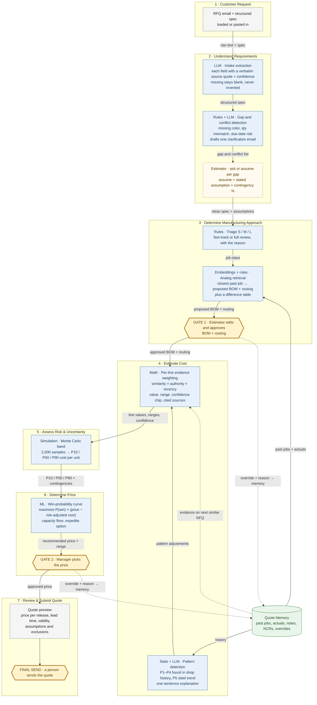

# Future State: Quoting with Quote Memory

**Quote Memory: Evidence-Weighted Quoting.** *Every number in the quote shows its sources, and how much you trust it depends on how good those sources are.*

The case's seven stages stay the same. What changes: AI does the reading, searching, weighting, and simulating, people make the calls at three gates, and every override teaches the next quote. The tool runs on a local PC (Streamlit + qwen3:8b via Ollama + local embeddings), works from past-job CSV exports, and needs no ERP swap. Customer data never leaves the building.

**Legend:** blue = AI and analytics (the tag says which kind) · gold hexagon = human gate · dashed gold = human decision · green = shop memory · **dashed arrows = the learning loop: override + reason → memory → evidence on the next similar RFQ.**

**Guardrail:** the LLM **never produces a cost or price number.** It only extracts fields (with source quotes and confidence), drafts the clarification email, and writes one-sentence pattern explanations. All math is deterministic Python. Every model call is cached, so the tool also runs in offline mode with no model at all.

## Stage by stage

| Stage | What AI does | What the human decides | What flows to the next stage |
|---|---|---|---|
| **1. Customer Request** | Takes the RFQ email text and structured spec as they arrive (loaded or pasted). No ERP swap. | Nothing yet. Anyone can load the RFQ. | Raw email text + structured spec. |
| **2. Understand Requirements** | **LLM** extracts each field with the verbatim source sentence and a confidence level. Missing fields stay blank. Python normalizes material aliases (e.g., "3/8 plate" = "0.375 A-36 HR"). **Rules** flag gaps (e.g., powder coat color missing), conflicts (e.g., qty 250 in the email vs. 200 on the spec), and due-date vs. lead-time risk. **LLM** drafts one clarification email covering every *ask* item. | For each gap, **ask** the customer or **assume** (stated assumption + contingency %, e.g., "assume black, +3%"). Whether to send the drafted email. | Clean spec, stated assumptions, contingency % per assumed gap. |
| **3. Determine Manufacturing Approach** | **Triage** labels the job S / M / L (fast-track vs. full review) and gives the reason. **Analog retrieval** blends description embeddings with structured match (family, material, thickness, qty, weld class) to find the closest won past job with actuals. Its BOM + routing is rescaled for qty. **Difference rules** add, remove, or keep lines (a one-time fixture on first runs, powder coat on a finish change, grind on cosmetic welds), shown in a difference table. | **Gate 1:** the estimator edits and approves the proposed BOM + routing. Any edit needs a written reason, which is saved to memory. | Approved BOM + routing (override notes go to memory). |
| **4. Estimate Cost** | **Evidence weighting** per BOM line and routing op: score = similarity × source authority (actual 1.0, note/override/pattern 0.8, past quote 0.6, shop default 0.3) × recency decay (half-life: material 30 days, labor 540, notes 365). Each line gets a value, range, green/yellow/red confidence chip, and clickable sources. **Pattern detection** adds labeled adjustment rows (e.g., P1 cosmetic-weld overrun, P2 first-run fixture setup, P3 thick-plate press-brake rework); the P5 steel trend becomes an escalation contingency when the material quote is stale. The **LLM** writes one sentence explaining each pattern. Stale material is flagged. | Reviews yellow and red lines in the evidence drawer ("Where this number came from"). Anything to change goes back through Gate 1, with a reason. | Per-line value, low/high range, confidence. |
| **5. Assess Risk & Uncertainty** | **Monte Carlo** (2,000 samples, triangular per line) adds up cost per unit as P10 / P50 / P90, plus gap contingencies. Lower confidence means a wider band. | Whether to re-quote material, shorten validity, or firm up an assumption instead of carrying the risk. | P10 / P50 / P90 cost per unit, contingencies. Risk-adjusted cost = P50 + 50% of (P90 − P50). |
| **6. Determine Price** | A **win-probability model** trained on past won/lost quotes (price-to-cost ratio, customer segment, new customer, qty bucket, customer history) produces an expected-margin curve. The recommended price maximizes P(win) × (price − risk-adjusted cost), so wider uncertainty means a bigger cushion. A shop-load slider raises the minimum margin and adds an opportunity cost on labor hours when the shop is busy. An expedite option is shown (illustrative: +12% for 1 week faster). P4 flags a price-sensitive customer. | **Gate 2:** the manager picks the price. A price outside the recommended range needs a written reason, which is saved to memory. | Approved price per release, lead time, standard or expedite. |
| **7. Review & Submit Quote** | Builds the quote preview: unit price by release size, setup per release and one-time tooling listed separately, lead time, validity window (shortened to 15 days if material is stale), assumptions and exclusions from *assume* gaps. Markdown/HTML download. | **Final send:** a person reads it and sends it. | Quote to the customer. Every override + reason already sits in memory as evidence for the next similar RFQ. |

## The chain reaction

Change any input and everything downstream re-runs. That includes flipping a gap from *ask* to *assume*, aging the material quote, or overriding a line at Gate 1. A **change banner** then shows **P50 cost, band width, and recommended price (before → after)**, plus **which lines changed confidence**. For example, aging the steel quote to 90 days turns the material line red, widens the band, raises the recommended price, and triggers the "re-quote or shorten validity" flag.
